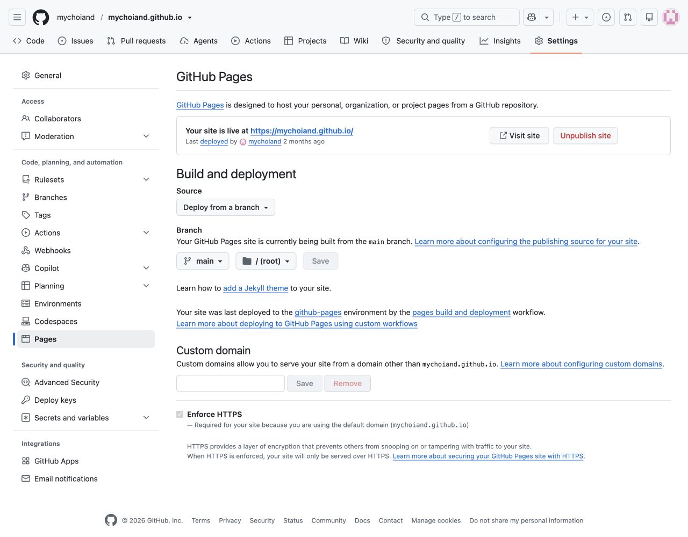
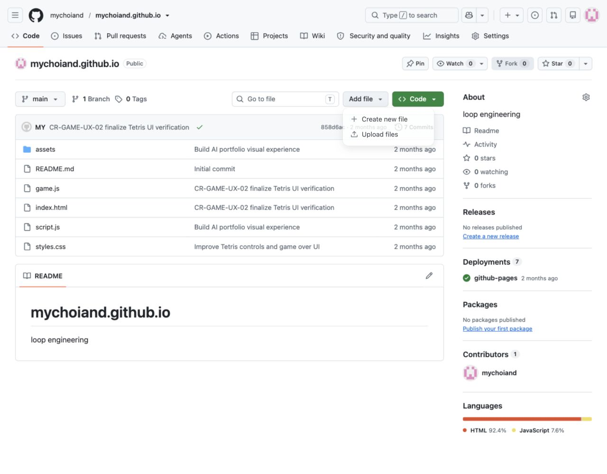
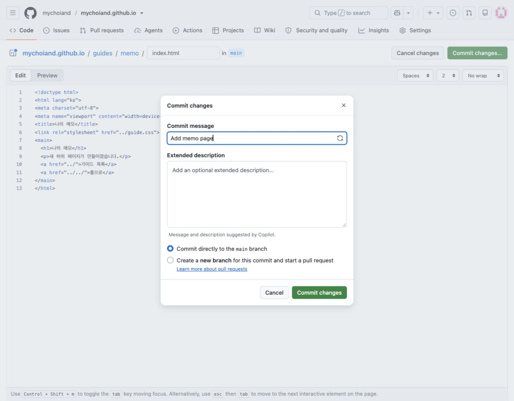
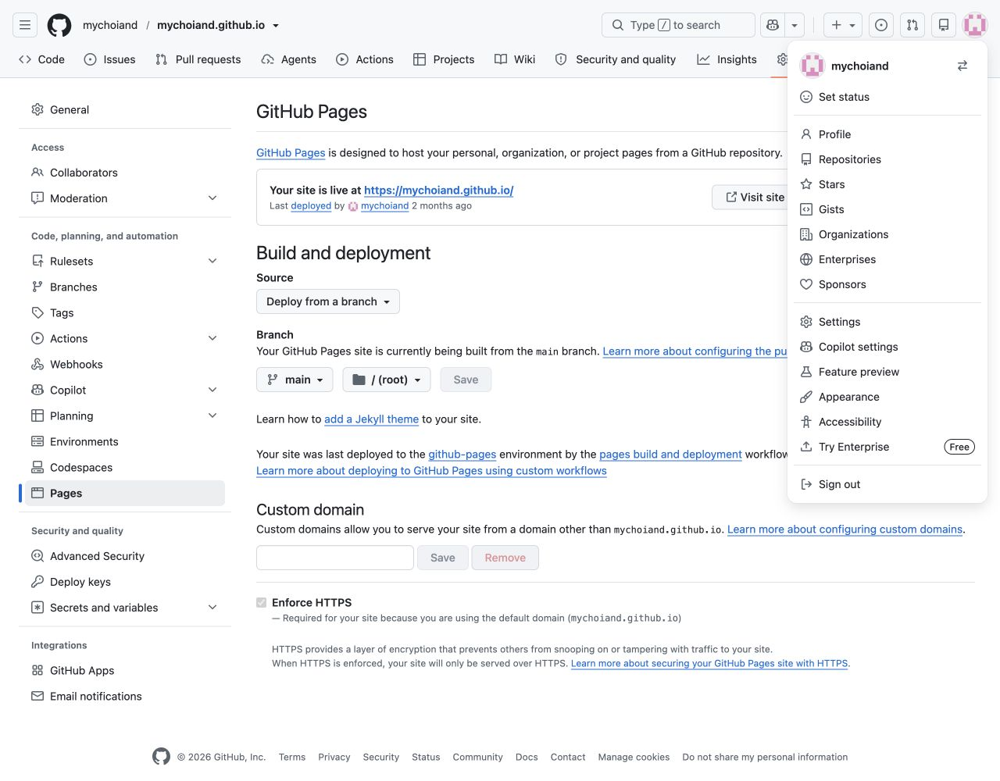
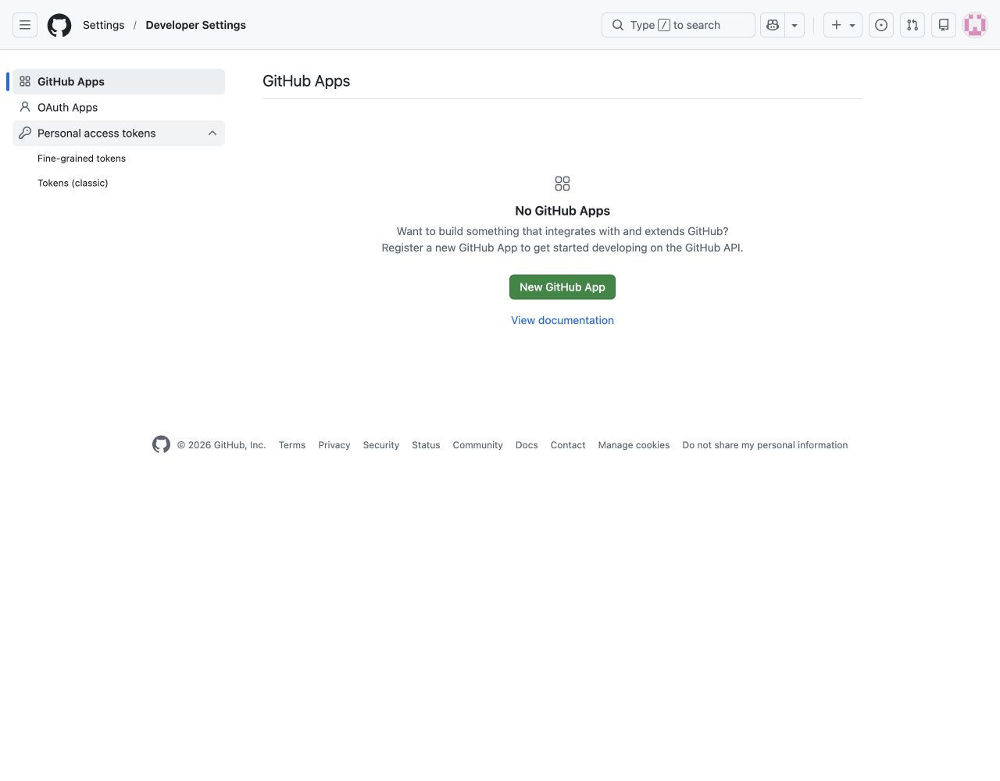
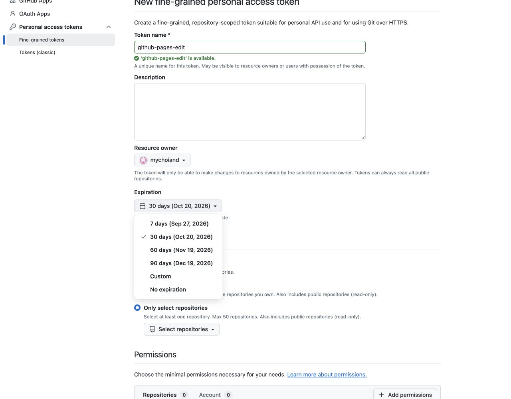

# GitHub Pages 처음부터 따라하기

기존 홈페이지를 유지하면서 문서를 하위 페이지로 추가하는 안내입니다. 실제 mychoiand 계정의 GitHub.com 화면을 기준으로 작성했습니다. 처음 만드는 사람은 순서대로 진행하고, 이미 사이트가 있다면 3단계부터 시작하세요.

화면 확인: 2026.09.20. 캡처는 실제 화면이며, 토큰 설정과 파일 입력 화면은 미저장 예시입니다. 토큰을 발급하거나 예시 memo 파일을 저장하지 않았습니다. 예제 문서는 guides/start와 guides/github-pages에서 확인할 수 있습니다.

## 1. 주소와 기본 용어 이해하기

저장소(repository)는 사이트 파일과 수정 이력을 보관하는 공간입니다. github.com은 파일을 관리하는 곳이고 github.io는 방문자가 완성된 페이지를 보는 곳입니다.

[소스 저장소 열기](https://github.com/mychoiand/mychoiand.github.io)

[공개 홈페이지 열기](https://mychoiand.github.io/)

```text
index.html                  → https://mychoiand.github.io/
guides/index.html           → https://mychoiand.github.io/guides/
guides/start/index.html     → https://mychoiand.github.io/guides/start/
```

index.html은 폴더 주소를 열 때 표시하는 기본 파일입니다. 별도 서버 프로그램 없이 HTML·CSS·이미지 파일을 제공하는 방식을 정적 호스팅이라고 합니다. CSS는 글꼴·색상·간격을 지정합니다. 하위 문서마다 새로운 저장소나 토큰을 만들 필요가 없습니다.

## 2. 처음 사이트를 만드는 경우

1. GitHub.com에 로그인합니다. 오른쪽 위 + 메뉴에서 New repository를 선택합니다.
2. Owner를 본인 계정으로 두고 Repository name에 본인아이디.github.io를 입력합니다. 이 예시는 mychoiand.github.io입니다.
3. 공개 실습용은 Public을 선택합니다. 공개 저장소의 파일은 누구나 볼 수 있으므로 회사 자료를 넣지 않습니다. README를 포함해 저장소를 생성합니다.
4. Add file → Create new file에서 최상위 index.html을 만듭니다. 아래 실습 HTML을 사용할 때는 기존 guides/guide.css 파일이 아직 없으므로 stylesheet 줄을 제외합니다.
5. Settings → Pages를 열고 Source를 Deploy from a branch, Branch를 main, 폴더를 /(root)로 지정한 뒤 Save합니다.
6. Actions의 Pages 배포가 성공한 다음 사용자 사이트 주소를 엽니다.

mychoiand.github.io 저장소는 이미 있으므로 다시 생성하지 않습니다. 새 저장소 생성 과정은 공식 절차 안내이며 이번 계정에서 재실행하거나 생성 화면을 캡처하지 않았습니다. 아래는 실제 기존 저장소의 설정입니다.



실제 저장소 Settings → Pages: main 브랜치의 /(root)에서 배포

브랜치(branch)는 소스 작업의 갈래이며 main은 이 저장소의 배포 기준입니다. /(root)는 저장소의 최상위 폴더를 뜻합니다. 개인 계정 Settings의 Pages 메뉴와 저장소 Settings의 Pages 메뉴를 구분하세요.

## 3. 하위 페이지 파일 만들기

1. 소스 저장소의 Code 탭을 엽니다. main 브랜치인지 확인합니다.
2. Add file → Create new file을 선택합니다.
3. 파일 이름에 guides/memo/index.html을 입력합니다. /를 입력하면 상단 경로가 guides → memo → index.html로 나뉩니다.
4. 편집 영역에 아래 코드를 붙여넣습니다. memo는 직접 실습할 새 폴더 이름입니다.



Code 탭의 Add file → Create new file

```html
<!doctype html>
<html lang="ko">
<meta charset="utf-8">
<meta name="viewport" content="width=device-width,initial-scale=1">
<title>나의 메모</title>
<link rel="stylesheet" href="../guide.css">
<main>
  <h1>나의 메모</h1>
  <p>새 하위 페이지가 만들어졌습니다.</p>
  <a href="../">가이드 목록</a>
  <a href="../../">홈으로</a>
</main>
</html>
```

파일 입력 예시의 경로와 코드는 다음 커밋 화면의 배경에서도 확인할 수 있습니다.

../는 한 단계 위 폴더입니다. 이 예시의 ../guide.css는 guides/guide.css를 가리킵니다. ../../는 두 단계 위인 홈페이지입니다. 한글 문장이 깨지면 UTF-8 설정을 확인합니다.

## 4. Commit으로 변경 저장하기

1. 오른쪽 위 Commit changes...를 누릅니다.
2. Commit message에 Add memo page처럼 변경 목적을 적습니다. 자동 제안된 설명은 실제 변경과 맞는지 확인합니다.
3. 현재 계정에서는 Commit directly to the main branch가 선택되어 있습니다. 개인 실습에서는 이 경로로 저장할 수 있습니다.
4. 마지막 Commit changes를 누르면 저장소에 파일과 변경 이력이 저장됩니다.



Commit message와 main 브랜치 직접 저장 선택 — 저장 전

커밋(commit)은 변경 내용에 설명을 붙인 저장 기록입니다. Pull request(PR)는 다른 브랜치의 변경을 검토한 뒤 합치는 요청입니다. 조직에서 main 직접 저장을 막았다면 새 브랜치와 PR을 사용하고 조직의 검토 절차를 따릅니다.

## 5. 목록에 링크 연결하기

1. Code 탭에서 guides 폴더의 index.html을 엽니다. 최상위 홈페이지의 index.html과 혼동하지 않습니다.
2. Edit file 또는 연필 아이콘을 눌러 편집합니다.
3. 가이드 목록 안에 아래 링크를 추가하고 Commit changes로 저장합니다.
4. 완성된 목록에서 나의 메모를 누르면 /guides/memo/로 이동해야 합니다.

```html
<a href="memo/">나의 메모</a>
```

파일을 생성했다고 메뉴에 자동으로 나타나는 것은 아닙니다. 문서 생성과 목록 연결을 함께 완료합니다. 사이트 전체에 새 문서를 추가할 때도 같은 방식으로 폴더와 메뉴 링크를 늘립니다.

## 6. 배포와 실제 페이지 확인하기

1. 저장소의 Actions 탭을 엽니다.
2. 이번 커밋에 해당하는 pages build and deployment 실행을 엽니다. 이전 성공 기록과 구분해 커밋과 실행 시각을 확인합니다.
3. build와 deploy가 완료되고 실행 상태가 성공인지 확인합니다. 실패하면 실패한 작업의 로그를 엽니다.
4. 실습을 저장했다면 https://mychoiand.github.io/guides/memo/를 엽니다. 기존에 만들어진 시작 안내는 아래 링크에서 확인할 수 있습니다.
5. 목록 → 문서 → 목록 → 홈페이지를 눌러 이동을 확인하고 모바일 폭에서도 글과 이미지가 잘리는지 확인합니다.

[실제 배포 실행 목록](https://github.com/mychoiand/mychoiand.github.io/actions)

[시작 안내 하위 페이지 주소](https://mychoiand.github.io/guides/start/)

배포(deploy)는 저장한 파일을 방문자가 볼 수 있게 게시하는 과정입니다. 커밋 완료와 배포 완료는 별개입니다. 기존 main / root 설정에서는 하위 파일을 추가할 때 Pages 설정을 다시 바꾸지 않습니다.

## 7. 토큰이 필요한 경우 구분하기

공개 페이지 읽기에는 키가 필요 없습니다. GitHub 웹 편집은 로그인으로 진행합니다. 자동화 도구는 연결 앱 자체에도 저장소 쓰기 권한이 있어야 합니다. 계정에서 수정 가능하더라도 연결 앱이 403을 반환할 수 있습니다. 연결 앱에서 쓰기가 허용되지 않으면 대상 저장소로 제한한 PAT나 승인된 SSH 인증을 사용합니다.

PAT(Personal access token)는 명령행이나 API가 본인을 대신해 GitHub에 접근할 때 쓰는 비밀 문자열입니다. SSH 키와는 다른 인증 방식입니다. 필요한 환경에서만 아래 절차로 발급하며, 페이지에 넣는 코드나 방문자용 비밀번호가 아닙니다.

## 8. 토큰 발급 메뉴 찾기

1. GitHub 오른쪽 위 프로필 사진을 누릅니다.
2. 열린 사용자 메뉴의 Settings를 누릅니다. 저장소 상단 Settings와 다른 메뉴입니다.
3. 개인 설정의 왼쪽 메뉴 맨 아래 Developer settings를 누릅니다. 화면에 안 보이면 아래로 스크롤합니다.
4. Personal access tokens를 펼친 뒤 Fine-grained tokens를 선택합니다.
5. Generate new token을 눌러 설정 양식을 엽니다. 재인증을 요구하면 본인이 완료합니다.



프로필 메뉴의 Settings로 개인 설정 열기



Developer settings → Personal access tokens → Fine-grained tokens

Developer settings는 브라우저 개발자 모드가 아닙니다. F12나 개발자 도구를 열 필요가 없습니다. Tokens (classic)는 다른 유형의 토큰입니다. 이 가이드는 저장소를 좁혀 선택할 수 있는 Fine-grained 방식입니다.

## 9. Expiration과 아래 항목 설정하기

1. Token name: github-pages-edit처럼 용도를 알아볼 이름을 입력합니다. 이름 자체는 비밀 키가 아닙니다.
2. Description: 선택 사항입니다. 예를 들어 개인 Pages 문서 수정용이라고 적습니다.
3. Resource owner: mychoiand를 선택합니다. 자기 계정의 저장소를 수정하기 위한 대상 소유자입니다.
4. Expiration: 만료 기간입니다. 짧은 실습 예시는 7 days를 선택합니다. 작업 기간이 길면 그 기간에 맞게 선택하고 만료 전에 갱신합니다. No expiration은 기본 선택으로 사용하지 않습니다.
5. Repository access: Only select repositories를 고릅니다. Select repositories에서 mychoiand.github.io를 검색하고 선택합니다.
6. Permissions → Add permissions → Contents를 추가합니다. Contents의 Access를 Read and write로 바꿉니다. Metadata의 Read-only는 자동으로 함께 추가됩니다.
7. 일반 HTML·이미지 수정에는 Account 권한이나 Administration 권한을 추가하지 않습니다. Workflows 파일 수정이나 Pages 설정 API 변경은 별도 작업이므로 필요한 경우에만 해당 권한을 따로 검토합니다.



Expiration 메뉴: 실습 예시는 7 days, 날짜는 발급일에 따라 달라짐

Public repositories 옵션은 공개 저장소를 읽기만 하는 선택입니다. 공개 사이트 코드를 수정하려면 대상 저장소 선택과 Contents 쓰기 권한이 필요합니다. 이 화면 캡처에서는 설정만 보여주며 Generate token은 누르지 않았습니다.

## 10. 본인이 키 발급 후 안전하게 보관하기

1. 실제로 토큰이 필요한지, 대상 저장소·권한·만료일이 맞는지 확인합니다.
2. 본인이 Generate token을 누릅니다. 생성된 비밀 문자열은 비밀번호 관리자에 즉시 저장합니다. 토큰을 다시 볼 수 없을 수 있으므로 이 단계를 완료하고 화면을 닫습니다.
3. 토큰을 채팅·스크린샷·Markdown·HTML·공개 저장소에 붙여넣지 않습니다. 가이드에는 발급 결과 화면을 첨부하지 않습니다.
4. Git 명령행은 Git Credential Manager 같은 자격 증명 관리자를 우선 사용합니다. macOS에서는 Keychain에 보관하는 인증 방식도 사용할 수 있습니다. HTTPS 인증의 Password 입력란에는 계정 비밀번호 대신 PAT를 사용합니다.
5. 자동화 도구가 파일을 요구할 때만 저장소 밖의 비공개 파일에 저장합니다. 파일 경로만 작업자에게 알려주고 키 내용은 보내지 않습니다.
6. 만료·분실·노출 시 해당 토큰을 폐기하고 필요한 범위로 다시 발급합니다. 페이지 자체는 토큰이 만료돼도 이미 배포된 상태로 계속 제공됩니다.

이 공개 가이드에는 개인 컴퓨터의 실제 키 파일 경로를 적지 않습니다. SSH를 이미 사용하는 환경이라면 PAT를 추가할 필요가 없는지 먼저 확인하세요. 토큰을 HTTPS URL에 직접 끼워 넣으면 명령 기록이나 로그에 남을 수 있으므로 사용하지 않습니다.

## 11. 자주 막히는 지점

1. 404: 경로의 대소문자, index.html 이름, Pages 배포 브랜치와 폴더를 확인합니다.
2. 이전 내용: Actions에서 이번 커밋 배포가 완료됐는지 확인한 뒤 새로고침합니다.
3. 이미지나 CSS만 안 보임: 현재 문서 폴더를 기준으로 상대 경로가 맞는지 확인합니다.
4. 403 또는 저장 권한 없음: 로그인 계정, 대상 저장소 선택, Contents 쓰기 권한, 만료일 및 조직 정책을 확인합니다.
5. 메뉴에 새 글 없음: guides/index.html에 링크를 추가했는지 확인합니다.
6. 회사 환경에서 메뉴가 다름: 설치된 Enterprise 버전·인증·Pages 운영 정책이 다를 수 있습니다. 회사 가이드는 별도 비공개 문서로 관리합니다.

## 12. 다른 환경에 적용할 때

GitHub.com 사용자 사이트는 본인아이디.github.io 형태입니다. 별도 프로젝트 저장소의 사이트는 보통 본인아이디.github.io/저장소명/ 형태입니다. pages.github.com은 GitHub Pages 서비스 안내 주소이며 개인 사이트 주소로 만드는 대상이 아닙니다.

회사 Enterprise Pages의 주소는 관리자가 지정한 호스트를 따릅니다. 외부에서 저장소에 로그인할 수 있다고 해서 Pages도 같은 범위로 공개된다는 뜻은 아닙니다. 접속 가능 범위와 저장소·사이트 접근 권한은 회사에서 별도로 확인합니다. 공개용 토큰과 회사용 인증은 서로 대체하지 않습니다.

## 공식 참고 문서

[GitHub Pages 생성](https://docs.github.com/en/pages/getting-started-with-github-pages/creating-a-github-pages-site)

[배포 소스 설정](https://docs.github.com/en/pages/getting-started-with-github-pages/configuring-a-publishing-source-for-your-github-pages-site)

[개인 액세스 토큰 발급·보관](https://docs.github.com/en/authentication/keeping-your-account-and-data-secure/managing-your-personal-access-tokens)
